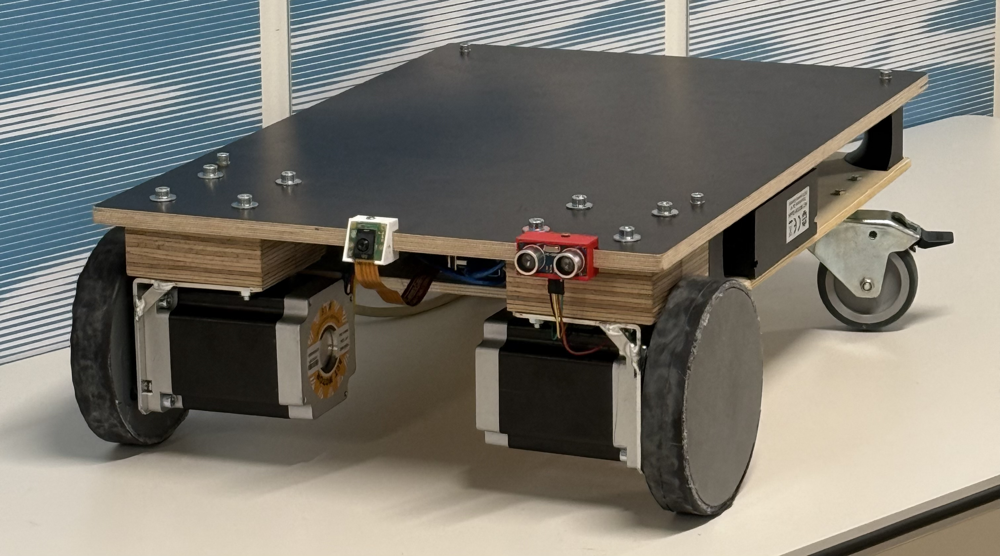
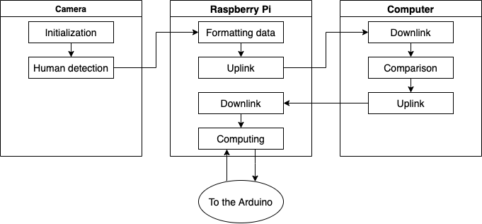
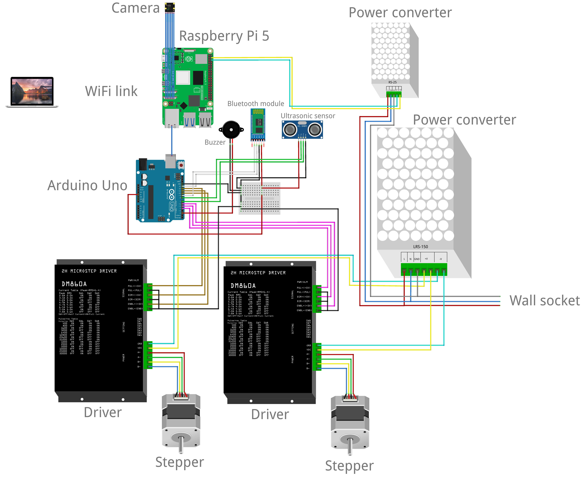
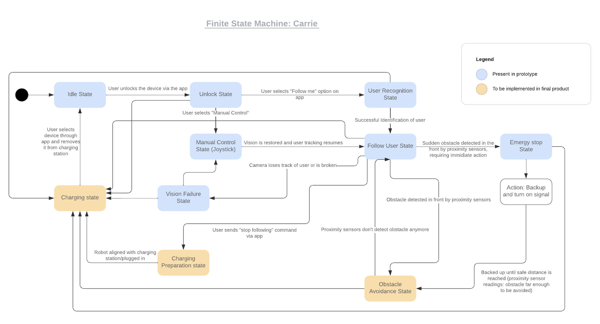

<div align="center">

# CarriE

### Autonomous person-following load carrier for public indoor spaces

*EPFL · Microengineering · Master · Fall 2024*

---

[](https://www.python.org/)
[](https://www.arduino.cc/)
[](https://flask.palletsprojects.com/)
[](https://pytorch.org/)
[](https://appinventor.mit.edu/)
[](https://www.epfl.ch/)

<!-- Add a photo of the robot here: -->



</div>

---

## Table of Contents

- [Overview](#overview)
- [Key Features](#key-features)
- [System Architecture](#system-architecture)
- [Repository Structure](#repository-structure)
- [Hardware](#hardware)
- [Software Deep Dive](#software-deep-dive)
  - [Computer Vision — Person Re-Identification](#computer-vision--person-re-identification)
  - [Motor Control — Finite State Machine](#motor-control--finite-state-machine)
  - [Calibration](#calibration)
  - [Mobile App](#mobile-app)
- [Getting Started](#getting-started)
- [Team](#team)
- [Full Report](#full-report)

---

## Overview

CarriE is an autonomous robotic platform designed to help users transport heavy loads (luggage, shopping bags, suitcases...)through large public indoor environments such as airports, shopping malls, and train stations. The user briefly calibrates the robot's camera to their appearance, then simply walks: CarriE autonomously follows them, maintaining a safe distance and avoiding obstacles along the way.

The concept is built around a **rental model**: robots are stationed at strategic hubs across public spaces. Users rent a unit via a mobile app, load their belongings (up to **30 kg**), and return it at any drop-off terminal at the end of their trip, similar to a bike-sharing system but for cargo.

Should the robot lose sight of the user or encounter an obstacle it cannot handle, it stops and alerts the user via buzzer, allowing them to take manual control through the companion app.

> Built as a prototype for the EPFL course *"Products Design and Systems Engineering in a Team"* (PDSE), this project spans mechanical design, embedded systems, computer vision, and mobile development, all integrated from scratch in a single semester.

---

## Key Features

| Feature | Description |
|---|---|
| **Person Re-Identification** | Identifies and exclusively follows the calibrated user using OSNet feature vectors and cosine similarity — ignores bystanders |
| **Depth Estimation** | Infers user distance from camera bounding-box height via a calibrated linear model |
| **Differential Drive** | Two independently driven NEMA 34 stepper motors for smooth forward motion and in-place turning |
| **Obstacle Detection** | HC-SR04 ultrasonic sensor triggers an immediate stop and buzzer alert when an obstacle enters the 60 cm safety zone |
| **Dual Control Modes** | Autonomous (vision-based) or manual (Bluetooth joystick from Android app), switchable at any time |
| **Kill Switch** | One-tap emergency stop accessible from the mobile app and hardware |
| **Tracking Smoothing** | Mode filter over a 20-frame sliding window prevents jitter from brief detection noise |
| **Automatic Reconnection** | Client video stream reconnects automatically on network dropout |
| **Modular Firmware** | Two separate Arduino sketches: `MotorFSM` (autonomous) and `Joystick_working` (manual) |

---

## System Architecture

CarriE's software is split across three compute nodes: an **external computer** running the Re-ID client, a **Raspberry Pi 5** running the Flask server and driving the IMX500 camera, and an **Arduino UNO** executing the motor FSM. In autonomous mode they communicate over WiFi and USB serial; in manual mode the Android app connects directly to the Arduino via Bluetooth.



---

## Repository Structure

```
Code Github/
│
├── Computer vision/              # Python — vision server + Re-ID client
│   ├── serveur.py               # Flask server: camera feed, detection, Arduino bridge
│   ├── clean_client.py          # Client entry point: connects to server & starts tracking
│   ├── client_utils.py          # Re-ID logic: calibration, feature matching, video threads
│   ├── ai_camera.py             # IMX500 detector wrapper (SSD MobileNetV2 FPN)
│   ├── FE_modif.py              # OSNet feature extractor wrapper
│   ├── osnet_x0_25_imagenet.pth # Pre-trained OSNet weights
│   └── models/                  # Deep learning model definitions
│       ├── osnet.py             # OSNet architecture (Omni-Scale Network)
│       ├── resnet.py            # ResNet variants
│       ├── mobilenetv2.py       # MobileNetV2
│       └── ...                  # 25 model files in total
│
├── MotorFSM/
│   └── MotorFSM.ino             # Arduino firmware: autonomous following + obstacle detection
│
├── Joystick_working/
│   └── Joystick_working.ino     # Arduino firmware: manual Bluetooth joystick control
│
├── calibration.m                # MATLAB: pixel-to-distance linear regression calibration
│
└── PDSE.apk                     # Android app (MIT App Inventor): joystick UI + kill switch
```

---

## Hardware

### Bill of Materials (Total: **445.22 CHF**)

| Category | Component | Qty | Cost (CHF) |
|---|---|:---:|---:|
| **Motorization** | Motor NEMA 34HS1456 | 2 | 102.00 |
| **Motorization** | DM860 Stepper Driver | 2 | 51.57 |
| **Motorization** | Power Transformer (LRS-150 24V) | 2 | 39.30 |
| **Structure** | Aluminium Brackets (laser-cut) | 3 | 5.70 |
| **Structure** | Composite Wood boards | 2 | 23.00 |
| **Structure** | 3D-printed structural supports | 4 | 4.35 |
| **Structure** | 3D-printed wheels (PETG + rubber) | 3 | 26.61 |
| **Structure** | 3D-printed sensor / camera holders | 3 | 1.14 |
| **Electronics** | Raspberry Pi 5 (4 GB) | 1 | 51.60 |
| **Electronics** | Raspberry Pi AI Camera (IMX500) | 1 | 60.20 |
| **Electronics** | Raspberry Pi Active Cooler | 1 | 15.60 |
| **Electronics** | Arduino UNO | 1 | 5.00 |
| **Electronics** | HC-05 Bluetooth Module | 1 | 3.00 |
| **Electronics** | HC-SR04 Ultrasonic Sensor | 1 | 5.00 |
| **Electronics** | Voltage Converter (RS-25 5V) | 1 | 1.00 |
| **Electronics** | Buzzer | 1 | 0.20 |
| **Electronics** | Cables, wires, SD card, adapters | — | 21.95 |
| | **Total** | | **445.22** |

> All wood was sourced and machined at EPFL's SKIL lab. Wheels were designed in CAD and 3D-printed in PETG, then wrapped in bicycle inner-tube rubber for traction.



---

## Software Deep Dive

### Computer Vision — Person Re-Identification

CarriE uses a two-model pipeline to detect and exclusively follow its registered user:

**1. Detection** — The Sony IMX500's on-chip neural accelerator runs **SSD MobileNetV2 FPN** (320×320) directly on the camera hardware, producing person bounding boxes without loading the Raspberry Pi's CPU.

**2. Re-Identification** — The Raspberry Pi streams cropped person images to an external computer running **OSNet_x0_25**, a lightweight person Re-ID backbone that produces 512-dimensional feature embeddings. During calibration, 30 feature vectors are collected (sampled every 50 frames so the user can turn around). At runtime, each detected person's embedding is compared to the calibration set via **cosine similarity**; anyone scoring below 0.7 is ignored.

#### Depth estimation

Distance is inferred from the bounding-box height using a linear model calibrated empirically for a 1.87 m person: `distance = -0.02 × (height_px / height_m) + 6.3`. A 4-pixel horizontal dead-zone at the frame centre filters out small jitter before the offset is forwarded to the Arduino.


#### Tracking smoothing

A 20-frame statistical mode filter is applied over the tracking history before each serial command is sent, preventing brief misidentifications from causing erratic motor behaviour.

---

### Motor Control — Finite State Machine

The Arduino firmware (`MotorFSM.ino`) implements a **differential drive FSM** that parses serial commands from the Raspberry Pi and drives two NEMA 34 steppers through DM860 drivers.

#### Serial protocol

The Raspberry Pi sends a newline-terminated CSV string over USB serial at 9600 baud: `"<depth_m>,<x_offset_m>,<tracking_int>\n"`. The Arduino parses all three fields on every loop iteration and updates its FSM state accordingly.

| Field | Type | Meaning |
|---|---|---|
| `depth_m` | float | Distance to user in metres |
| `x_offset_m` | float | Signed horizontal offset (− left, + right) |
| `tracking_int` | int | `1` = following · `−2` = person lost · `−3` = client disconnected |

#### FSM states and motion logic



| State | Trigger | Action |
|---|---|---|
| **Stop (too close)** | `depth < 1.0 m` | Disable motors |
| **Follow straight (slow)** | `tracking=1`, aligned, depth 1–3 m | Both wheels at 200 steps/s |
| **Follow straight (fast)** | `tracking=1`, aligned, depth > 3 m | Both wheels at 350 steps/s |
| **Turn left** | `tracking=1`, `Xdist < 0` | L=100, R=230 steps/s |
| **Turn right** | `tracking=1`, `Xdist > 0` | L=230, R=100 steps/s |
| **Lost / Error** | `tracking ≠ 1` | Beep + disable motors |

#### Obstacle detection

Every 15 loop iterations the HC-SR04 sensor is polled. Distance is smoothed with a 5-sample moving average. If the reading drops below **60 cm**, all motor outputs are immediately disabled and the buzzer sounds.

---

### Calibration

The pixel-to-depth mapping is established with `calibration.m`. Two sessions were run for persons of different heights (1.87 m and 1.70 m): bounding-box heights were recorded at known distances (0.65 m increments from 0.65 m to 3.9 m), a linear polynomial was fitted with MATLAB's `fit()`, and the result validated the formula used in `serveur.py`. The linear model is a good approximation in the 1.5–4 m operating range.

---

### Mobile App

The companion Android app (`PDSE.apk`) was built with [MIT App Inventor](https://appinventor.mit.edu/). It pairs with the Arduino's **HC-05 Bluetooth module** and provides:

- **Virtual joystick** — sends `"X,Y,button\n"` strings (X, Y ∈ [0, 200]) at 9600 baud
- **Mode toggle** — switches between `Auto` (vision-based) and `Manual` (joystick) modes
- **Kill switch** — large red button that immediately stops the robot
- **Status display** — shows live X/Y joystick values and Bluetooth connection state


The joystick firmware (`Joystick_working.ino`) maps X/Y values to differential wheel speeds using unicycle kinematics, with a maximum linear velocity of **0.5 m/s**.


---

## Team

**CarriE** was designed and built by the following team:

| Name |
|---|
| Gaëlle Pillon |
| Lucas Shang |
| Tirui Wang |
| Kilian Pouderoux |
| Benjamin Deprez |

**Teaching assistant:** Chrysoula Stathaki  
**Professors:** Yves Bellouard · Edoardo Charbon  
**Institution:** EPFL — École Polytechnique Fédérale de Lausanne  
**Course:** Products Design and Systems Engineering in a Team (PDSE) — Fall 2024

---

## Full Report

The complete 59-page project report covers the product concept, market analysis, all technical design decisions, manufacturing, intellectual property analysis, business plan, and project management.

📄 [`02_final_report.pdf`](docs/02_final_report.pdf)

Topics include:
- Technical and functional requirements (structure, propulsion, control, safety)
- Design alternatives explored (brushless vs. stepper, RFID vs. camera tracking, lidar vs. ultrasonic)
- Motor torque calculations and mechanical modelling (Newton's second law on inclined plane)
- Person Re-ID pipeline rationale (YOLO → MobileNet + OSNet migration)
- Full Finite State Machine design (prototype states + future states for charging and vision failure)
- Prototype fabrication details (SKIL lab, laser-cut aluminium brackets, 3D-printed PETG wheels)
- Intellectual property analysis and patent landscape
- Pre-business plan with SWOT analysis and pricing model (breakeven in 64 days at Zurich Airport)
- Gantt chart and work breakdown structure
